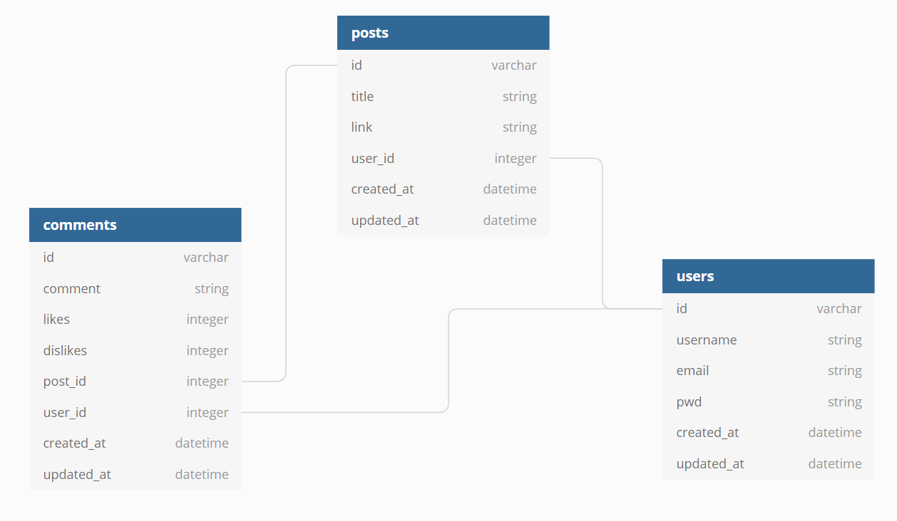

# Micro Reddit Database

## This database is a project developed as part of the Microverse curriculum, to be more specific, is part of the Ruby on Rails module.

#### It consists in a database created for a Micro Reddit app, no front end implement at this point, only the database models

### Relational Model




### Built using
    - Ruby
    - Ruby On Rails
    - Rubocop
    - SQLite3
    - Github
    - RubyMine

## Getting Started

To get a local copy up and running follow these simple example steps.

### Prerequisites

* Make sure that **Ruby Environment** is installed in your computer (try to run _ruby_ from your prompt), if not you can install it from [here.](https://www.ruby-lang.org/en/downloads/)

* [Download](https://github.com/kensayo/micro-reddit/archive/refs/heads/development.zip) and unzip **or** [clone this repository](https://docs.github.com/es/github/creating-cloning-and-archiving-repositories/cloning-a-repository)


### Setup

- Open your terminal and move to the root of the project, using ```cd``` command.
- Then you must run ```$ rails db:migrate```, so you can work locally with the database.
- Run ```$ rails db:create``` so you create the database
- You must run ```$ bundle install```  
- Start server using ```$ rails s```

### Usage

- You can create rows using Active Record in the`Ruby Console`

## 👤 Kenny Ortega

- GitHub: [kensayo](https://github.com/kensayo)
- Twitter: [@kensayo](https://twitter.com/kensayo)
- LinkedIn: [LinkedIn](https://www.linkedin.com/in/kenny-ortega-3580aa33/)


### Contributions and issues are welcome!

License
This project is MIT licensed.
